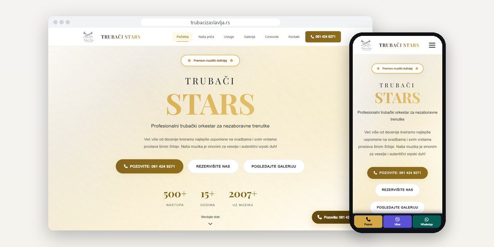
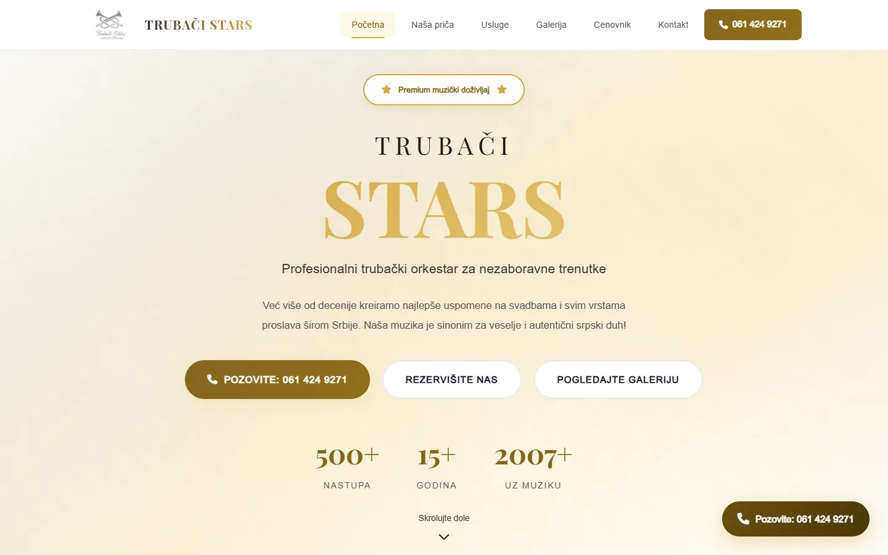
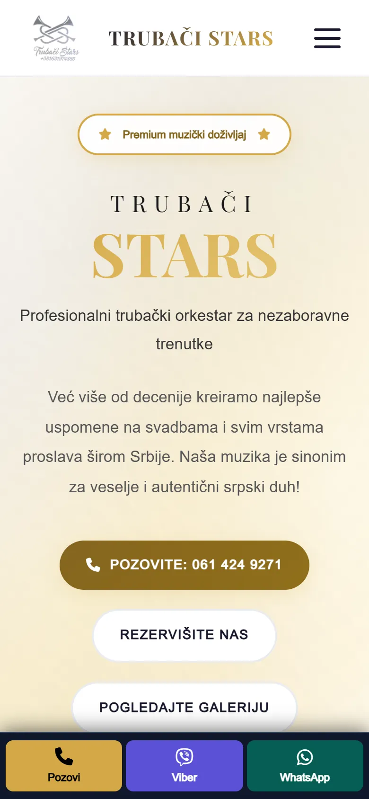
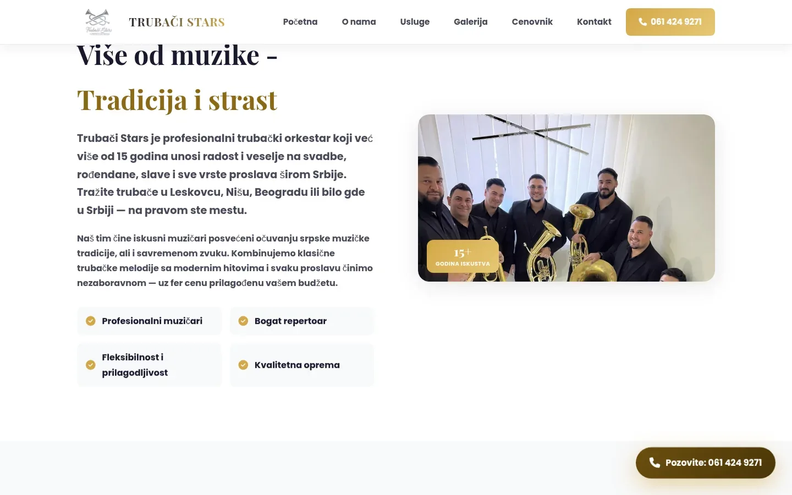
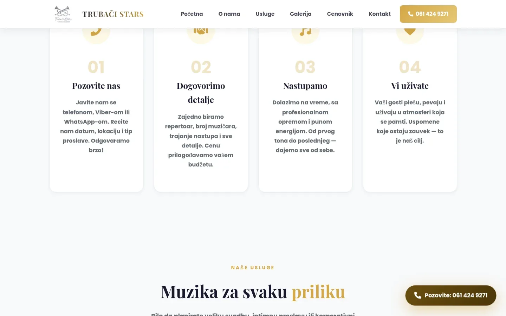

# Trubači Stars

105-page site for a Leskovac brass band that plays slavas, christenings and birthdays across Serbia, booked only by phone.

**[trubacizaslavlja.rs](https://trubacizaslavlja.rs/)** · [Case study (in Serbian)](https://svilenkovic.com/radovi/trubaci-stars) · [Srpski](README.sr.md)

> [!NOTE]
> Client project. The source code belongs to the client and stays in a private repository. This page describes what I built and how.

<table>
  <tr><td><b>Client</b></td><td>Trubači Stars</td></tr>
  <tr><td><b>Industry</b></td><td>Brass band for celebrations</td></tr>
  <tr><td><b>Location</b></td><td>Leskovac, Serbia</td></tr>
  <tr><td><b>Type</b></td><td>Multi-page website</td></tr>
  <tr><td><b>My role</b></td><td>Design, development, SEO, hosting and maintenance</td></tr>
  <tr><td><b>Stack</b></td><td>PHP 8.3, nginx, FastCGI cache, JSON-LD, self-hosted fonts</td></tr>
</table>

## About the project

Trubači Stars is a brass band from Leskovac that travels across Serbia to play at slavas, christenings, birthdays, graduations and other celebrations. A band like this is booked by phone: people call and ask two things, whether the date is free and what it costs. So the site has to get someone searching for trumpeters in their own town, for their own occasion, to the phone number in as few steps as possible.

Besides six core pages there are 27 pages for occasions and saints' days and 60 town pages, all sharing seven PHP includes. When the client asked for a third domain, I measured the two he already had and split them by search intent instead. The celebration and wedding content moved here with 301 redirects. The hardest bug was a layout shift that Google's lab test never saw: on a cold visit the fallback font was wider than the real one, so the hero buttons wrapped to a second line and then jumped back.

## What I built

- No contact form anywhere: five routes to the same number, including a sticky call, Viber and WhatsApp bar on phones
- A first-party call counter that logs time, page and button for every `tel:` click, without cookies or IP addresses
- A price page that explains the six factors behind the price instead of listing figures
- Town names fixed in 191 places on 58 pages, where a template had glued case endings onto the nominative
- An invented star rating with 127 votes removed from 158 pages across both of the band's sites
- A fallback font with `size-adjust: 95%` and `font-display: optional` on all 18 font faces, which ended the layout shift

## Results

| | Performance | Accessibility | Best practices | SEO |
| :-- | :-: | :-: | :-: | :-: |
| Mobile | 91 | 100 | 100 | 100 |
| Desktop | 100 | 100 | 100 | 100 |

PageSpeed Insights, lab test of the live site, September 2026. Security headers: 6 of 6. HTML validator: no errors. axe accessibility check: no violations. Structured data: `BreadcrumbList`, `FAQPage`, `LocalBusiness`, `MusicGroup`, `Organization`.

## Screenshots

<table>
  <tr>
    <td width="68%" valign="top"></td>
    <td width="32%" valign="top"></td>
  </tr>
</table>

The "Više od muzike - Tradicija i strast" (More than music: tradition and passion) section

How it works: four steps from the call to the performance, then music for every occasion

---

Built by [D. Svilenković](https://svilenkovic.com).
